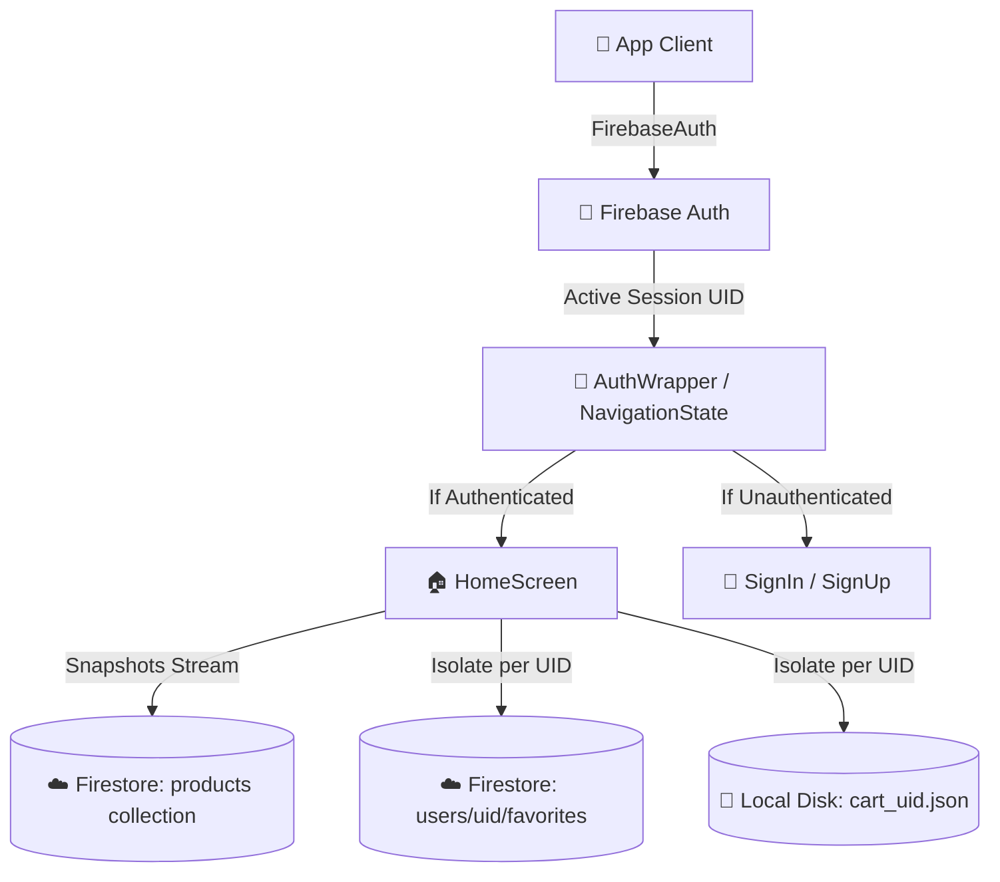

# 🌊 Flutter E-Commerce Application

🌐 **Live Demo:** [e-commerce-app-nabeeh-mohammed.netlify.app](https://e-commerce-app-nabeeh-mohammed.netlify.app/)

 E-Commerce Application is a high-performance, visually stunning, and feature-rich e-commerce mobile application built using the **Flutter SDK** and **Dart**. Adhering to the premium **"Aurora Glass"** UI design language, it utilizes vibrant gradients, subtle micro-animations, premium custom glassmorphic loading indicators, and modern typography to deliver a state-of-the-art shopping experience.

Powered by **Provider** for clean state management and integrated deeply with **Google Firebase**, ShopWave offers seamless real-time database syncing, multi-user isolation, secure cloud wishlists, and isolated shopping carts.

---

## 🚀 Key Features

*   **Secure Multi-User Authentication:** Integrated with **Firebase Authentication** supporting real-time validation for SignUp and SignIn. Secure session state is actively tracked at the root level using a reactive `StreamBuilder`.
*   **Real-time Database Syncing:** Product lists, categories, and inventories are streamed live from **Cloud Firestore** using `snapshots()`. This ensures that price changes, discounts, and inventory counts are updated instantly across all devices.
*   **User-Specific Cloud Favorites (Exercise 3):** Wishlist items are isolated securely in the cloud under `users/{userId}/favorites`. Changes are managed through `set()`, `update()`, and `delete()`, synced in real-time, and supported by Firestore's offline cache.
*   **Isolated Local Shopping Cart:** Shopping cart items are stored dynamically on a per-user basis. By listening to auth changes, the cart writes and reads from unique `cart_{userId}.json` files on local storage, preventing other users on the same device from seeing your items.
*   **Automatic Cloud Database Seeding:** Built-in smart seeder that automatically populates the remote database with 10 high-quality products (images, prices, ratings, and time-left counts) upon first startup if Firestore is empty.
*   **Cohesive Premium UI & Navigation:** 
    *   Dynamic background profile loading that updates and reloads the authenticated user's credentials in real-time.
    *   System-wide theme-aware transparent inputs to eliminate unsightly black bounding boxes inside Search and Coupon fields under Dark Mode.
    *   Stateful global tab indices that automatically reset to `0` (Home screen) on login, signup, and logout to guarantee a fresh experience.

---

## 🏗️ Architecture & Data Flow



---

## 🛠️ State Management Architecture

E-Commerce Application utilizes the **Provider** design pattern to decouple UI presentation from business logic. The application is initialized under a global `MultiProvider` tree to make states globally accessible yet highly responsive:

```dart
MultiProvider(
  providers: [
    ChangeNotifierProvider(create: (_) => ProductProvider()),
    ChangeNotifierProvider(create: (_) => CartProvider()),
    ChangeNotifierProvider(create: (_) => FavoriteProvider()),
    ChangeNotifierProvider(create: (_) => NavigationProvider()),
  ],
  child: const MyApp(),
);
```

### State Components
1.  **ProductProvider:** Streams live inventory data from Firestore, handles caching fallbacks, and executes background synchronization and database seeding.
2.  **CartProvider:** Implements shopping cart logic, counts quantities, handles subtotals, listens to authentication changes to switch local files (`cart_{userId}.json`), and wipes memory data cleanly on sign-out.
3.  **FavoriteProvider:** Listens to authentication state changes to dynamically subscribe/unsubscribe to the live user-specific cloud stream (`users/{userId}/favorites`). Handles secure additions (`set()`) and deletions (`delete()`).
4.  **NavigationProvider:** Manages active tab indices, provides unified triggers (`goHome()`), and resets active screens during session state changes to keep navigation clean.

---

## 🎓 Executed Laboratories & Exercises

### 🏆 Exercise 1 — Connect Your App to Firebase
*   Configured Firebase Core and connected the Android codebase natively using `flutterfire configure`.
*   Enabled Email/Password Sign-In methods inside the Firebase Console.
*   Built the premium `SignInScreen` and `SignUpScreen` with comprehensive form validators.
*   Implemented `AuthWrapper` at the entry point using `StreamBuilder` to dynamically switch view states based on `authStateChanges()`.

### 🏆 Exercise 2 — Move Data to Cloud Database
*   Migrated the local mock data setup to a fully cloud-backed architecture using **Cloud Firestore**.
*   Built robust serialization mappers `Product.fromDoc()` and `Product.toMap()` to marshal Firestore document documents.
*   Implemented automated database seeding inside the initialization lifecycle of `ProductProvider` to self-populate remote Firestore if empty.
*   Configured security rules on Cloud Firestore to allow seamless read/write access.

### 🏆 Exercise 3 — Personal Favorites with Firebase
*   Created isolated subcollections for user favorites in Cloud Firestore (`users/{userId}/favorites`).
*   Configured `snapshots()` on `FavoriteProvider` to stream live updates and dynamically notify rebuilding consumers across the UI.
*   Replaced local offline file manipulation with cloud-native `set()` and `delete()` Firestore transactions.
*   Leveraged Firestore's native cache to support full offline availability out-of-the-box.

---

## 🛠️ Technology Stack & Libraries

*   **Framework:** Flutter (Dart)
*   **State Management:** Provider
*   **Authentication:** Firebase Auth
*   **Database:** Cloud Firestore
*   **Local Caching:** Path Provider & SQFLite FFI (Desktop Support)
*   **Device Context:** Connectivity Plus (Internet detection & Fallbacks)
*   **Design Tokens:** Google Fonts (Outfit, Inter), Custom HSL Palette, Linear Gradients, Glassmorphism Cards.
